# tokokita

Nama : Muthia Khanza
NIM : H1D022008
Shift Baru : C
Shift Lama : A

# 1. Register

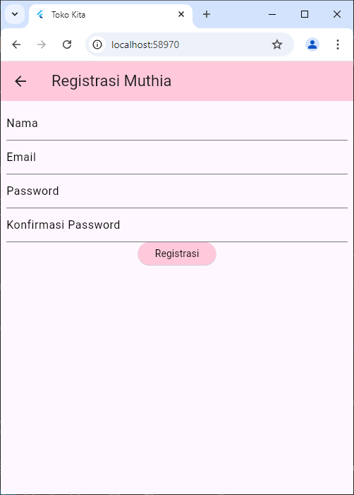
`RegistrasiPage` adalah halaman registrasi untuk pengguna baru membuat akun. Menggunakan `StatefulWidget` untuk mengelola status form. Halaman ini menampilkan beberapa `TextFormField` untuk memasukkan nama, email, password, dan konfirmasi password, masing-masing dengan validasi untuk memastikan data yang dimasukkan memenuhi kriteria tertentu. Ketika tombol registrasi ditekan, metode `_submit()` memvalidasi input, dan jika valid, data dikirim ke backend melalui `RegistrasiBloc.registrasi()`. Jika registrasi berhasil, dialog sukses muncul, sedangkan jika gagal, dialog peringatan ditampilkan. Halaman ini juga mengelola status loading untuk mencegah pengiriman ulang selama proses registrasi.

Berikut adalah contoh tampilan registrasi ketika sukses dan gagal.
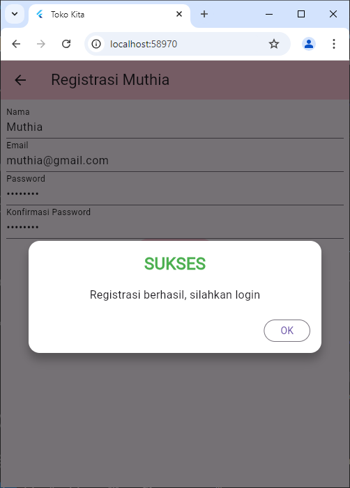
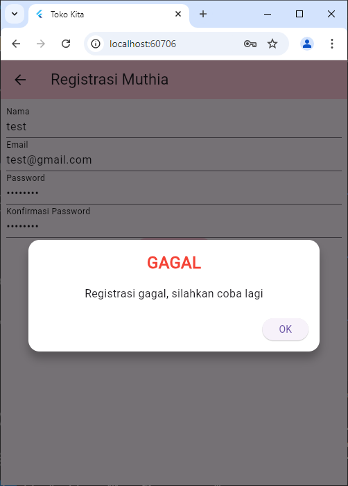

# 2. Login

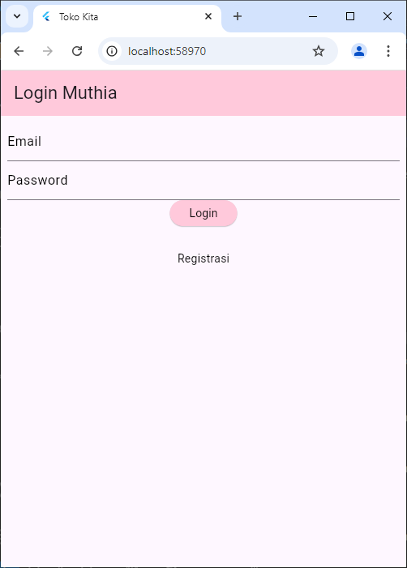
Setelah registrasi berhasil pengguna akan di arahkan untuk melakukan login. `LoginPage` adalah halaman untuk masuk ke aplikas. Menggunakan `StatefulWidget` untuk mengelola status form. Halaman ini menampilkan dua `TextFormField` untuk memasukkan email dan password, lengkap dengan validasi untuk memastikan bahwa keduanya diisi. Ketika tombol login ditekan, metode `_submit()` akan memvalidasi input, dan jika valid, data login akan dikirim ke backend melalui `LoginBloc.login()`. Jika login berhasil, token dan ID pengguna akan disimpan menggunakan `UserInfo`, dan pengguna akan diarahkan ke halaman `ProdukPage`. Jika login gagal, dialog peringatan akan ditampilkan. Selain itu, terdapat menu untuk mengarahkan pengguna ke halaman registrasi jika mereka belum memiliki akun.

# 3. List Produk

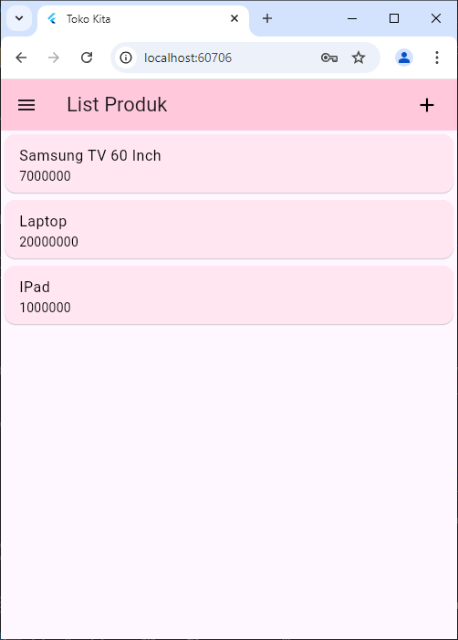
Ketika pengguna behasi melakukan login. Pengguna akan diarahkan pada tampilan list produk seperti gambar di bawah ini.
`ProdukPage` adalah halaman yang menampilkan daftar produk dalam aplikasi. Halaman ini menggunakan `StatefulWidget` untuk mengelola status dan menampilkan berbagai komponen UI.
Di bagian atas, terdapat `AppBar` dengan judul "List Produk" dan tombol untuk menambahkan produk baru. Ketika tombol ini ditekan, pengguna diarahkan ke halaman `ProdukForm` yang di tunjukan pada gambar nomer 4. Terdapat juga `Drawer` yang memungkinkan pengguna untuk melakukan logout. Tampilaannya ditunjukan pada gambar nomer 5. Ketika menu logout dipilih, pengguna akan diarahkan kembali ke halaman `LoginPage` setelah proses logout selesai.
Bagian utama dari halaman ini menggunakan `FutureBuilder` untuk mengambil daftar produk dari backend melalui `ProdukBloc.getProduks()`. Jika pengambilan data berhasil, daftar produk ditampilkan dalam bentuk `ListProduk`, yang merupakan widget terpisah yang membangun daftar produk menggunakan `ListView.builder`.
Setiap item produk dalam daftar diwakili oleh widget `ItemProduk`, yang menampilkan nama dan harga produk. Ketika pengguna mengetuk salah satu item, mereka akan diarahkan ke halaman `ProdukDetail` untuk melihat informasi lebih lanjut tentang produk tersebut.

# 4. Tambah Produk

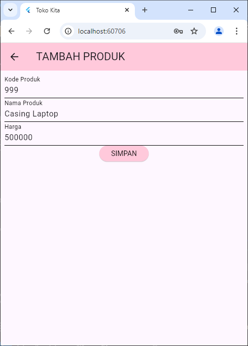
Ketika pengguna menekan ikon tambah pada halaman list produk maka pengguna akan diarahkan pada halaman ini tambah produk. Bagian untuk menambah produk diatur dalam kelas `ProdukForm` memungkinkan pengguna untuk mengisi data produk baru melalui antarmuka yang intuitif. Pada inisialisasi, judul form dan teks tombol diatur ke "TAMBAH PRODUK" dan "SIMPAN". Terdapat tiga `TextFormField` untuk input kode, nama, dan harga produk, masing-masing dilengkapi dengan validator untuk memastikan input tidak kosong. Ketika tombol simpan ditekan, form akan divalidasi, dan jika validasi berhasil, fungsi `simpan()` akan dipanggil. Fungsi ini membuat objek `Produk` baru berdasarkan input pengguna dan mengirimnya ke backend menggunakan `ProdukBloc.addProduk()`. Jika penyimpanan berhasil, pengguna akan diarahkan kembali ke halaman daftar produk, seperti gambah di bawah ini.
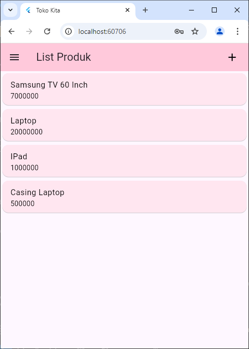

# 5. Detail Produk

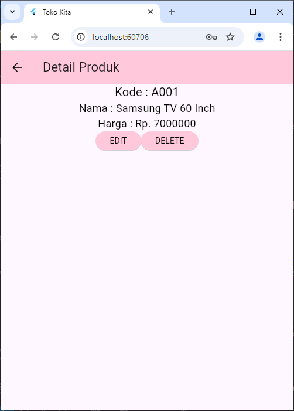
Ketika pengguna menekan dalah satu card yang ada pada list produk maka pengguna akan diarahkan pada tampilan ini. Bagian untuk menampilkan detail produk dalam kelas `ProdukDetail` memungkinkan pengguna untuk melihat informasi lengkap tentang produk tertentu. Halaman ini menampilkan kode, nama, dan harga produk dengan teks yang diformat untuk kejelasan. Terdapat juga dua tombol: "EDIT" dan "DELETE". Saat tombol "EDIT" ditekan, pengguna diarahkan ke halaman `ProdukForm` untuk memperbarui informasi produk yang sama, menggunakan objek produk yang ada. Sedangkan tombol "DELETE" memicu fungsi `confirmHapus()`seperti gambar nomer 7, yang menampilkan dialog konfirmasi untuk memastikan apakah pengguna benar-benar ingin menghapus data tersebut. Jika pengguna mengonfirmasi penghapusan, fungsi `ProdukBloc.deleteProduk()` dipanggil untuk menghapus produk dari backend. Jika penghapusan berhasil, pengguna diarahkan kembali ke halaman daftar produk, dan jika gagal, dialog peringatan ditampilkan untuk memberi tahu pengguna bahwa penghapusan gagal.

# 6. Ubah Produk

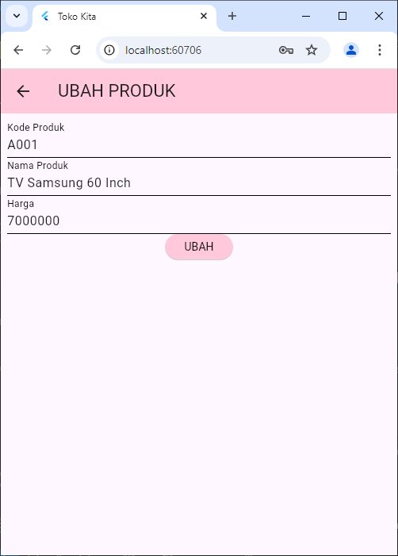
Ketika pengguna menekan tombol edit pada halaman detail maka pengguna akan diarahkan pada halaman form ubah ini. Bagian edit dalam kelas ProdukForm memungkinkan pengguna untuk memperbarui informasi produk yang sudah ada. Ketika halaman dibuka, metode initState() dipanggil, yang memanggil fungsi isUpdate(). Fungsi ini memeriksa apakah objek produk yang diterima tidak null, menandakan bahwa pengguna sedang dalam mode pengeditan. Jika demikian, judul halaman diubah menjadi "UBAH PRODUK", dan tombol yang ditampilkan menjadi "UBAH". Selanjutnya, nilai dari kodeProduk, namaProduk, dan hargaProduk diisi ke dalam kontrol teks yang sesuai menggunakan TextEditingController.

Saat pengguna mengklik tombol "UBAH" di bagian \_buttonSubmit(), validasi form dilakukan untuk memastikan bahwa semua kolom terisi dengan benar. Jika validasi berhasil, fungsi ubah() dipanggil. Dalam fungsi ini, objek Produk baru dibuat menggunakan ID dari produk yang sedang diedit, dan nilai-nilai dari kontrol teks diambil untuk diperbarui. Kemudian, ProdukBloc.updateProduk() dipanggil untuk mengirim permintaan pembaruan ke backend. Jika pembaruan berhasil, pengguna akan diarahkan kembali ke halaman daftar produk (ProdukPage) seperti gambar dibawah ini.
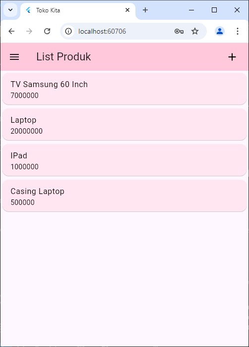

# 7. Delete Produk

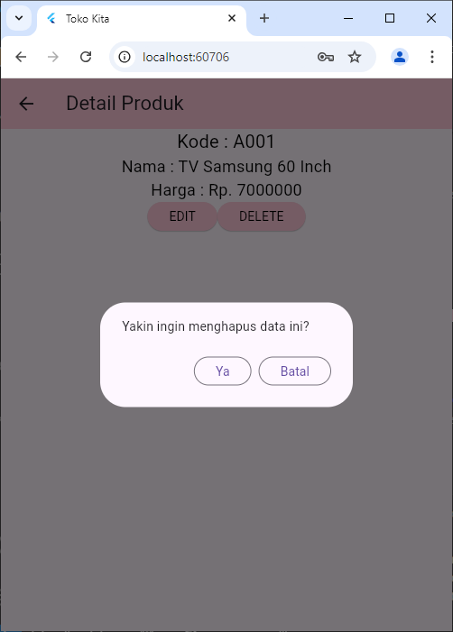
Pada halaman detail juga terdapat tombol delete yang ketika ditekan akan memunculkan pessan konfirmasi seperti gambar diatas. Bagian delete diatur dalam kelas `ProdukDetail`yang menangani proses penghapusan produk. Saat tombol ini ditekan, metode `confirmHapus()` dipanggil untuk menampilkan dialog konfirmasi yang meminta pengguna untuk memastikan apakah mereka ingin melanjutkan penghapusan. Jika pengguna memilih tombol "Ya", metode `ProdukBloc.deleteProduk()` dipanggil dengan ID produk yang ingin dihapus. Jika penghapusan berhasil, pengguna diarahkan kembali ke halaman `ProdukPage` seperti gambar dibawah ini Tombol "Batal" dalam dialog memungkinkan pengguna untuk membatalkan aksi.
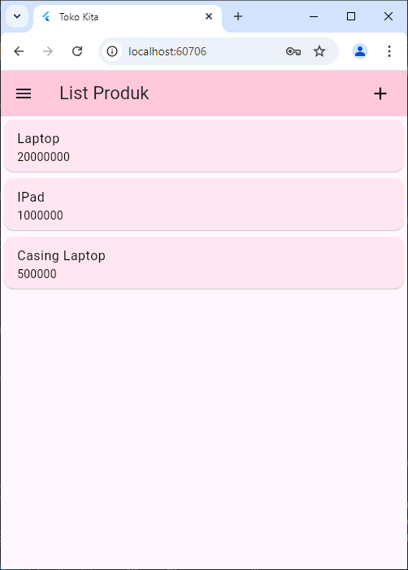

# 8. Logout

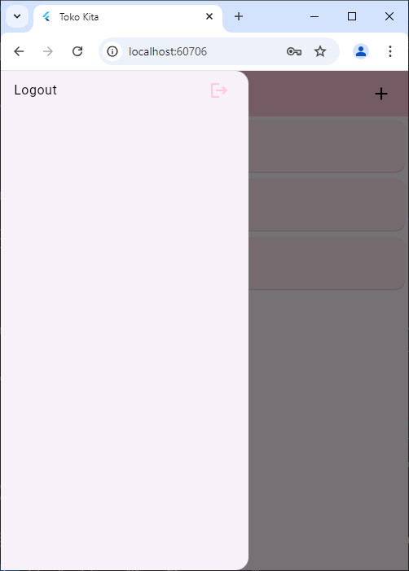
Pada halama detai terdapat burger menu yang krtika ditekan maka akan memunvulkan tampilan sperti gambar diatas. Ketika pengguna menekan ikon logout maka seluruh aktivitas akan kembali pada awal atau tampilan awal yaitu login.
